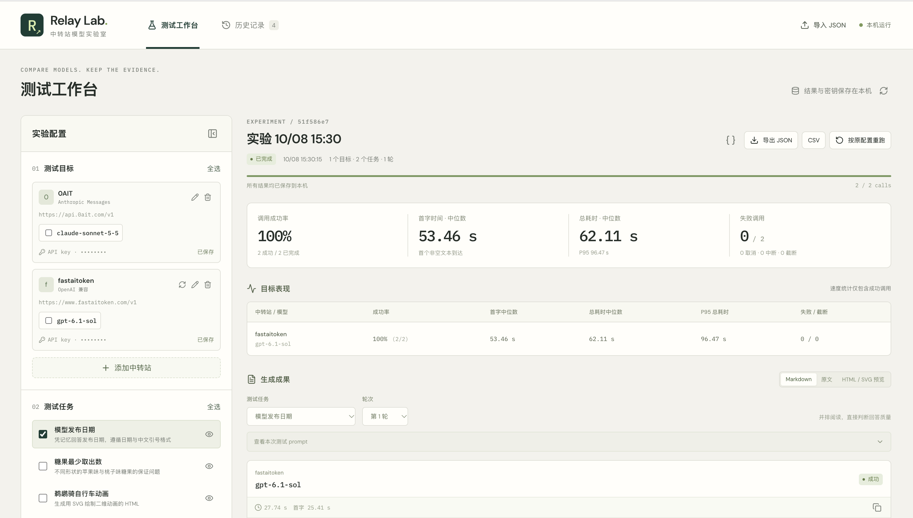

# Relay Lab · 中转站模型实验室

**用同一组任务，亲自比较不同中转站上的 Claude、GPT 等模型。**

Relay Lab 是一款本机运行的中转站模型检测与对比工具。它帮你回答几个实际问题：哪个中转站能正常调用？哪个模型更适合你的任务？响应速度和回答效果有什么差别？

所有比较都基于你实际发出的请求和模型返回的结果。实验记录保存在自己的电脑上，之后可以回看、导出或按原配置重跑。



## 为什么使用 Relay Lab

- **同题比较，更容易看出差别**：让多个中转站和模型回答相同任务，支持重复测试，减少 prompt 和测试条件不同带来的干扰。
- **看真实表现，不只看模型名称**：直接查看完整回答、调用成功率、首字时间和总耗时；接口提供 token 用量时也会一并展示。
- **每次调用都有记录**：按任务和轮次并排阅读结果，展开查看单次调用详情；实验完成后还可以筛选历史、导出数据或重跑。
- **按自己的工作来测试**：使用内置任务，也可以编写自己的 prompt。生成的 Markdown、原文和 HTML/SVG 内容都能查看，适合测试文本回答和可视化输出。
- **数据留在本机**：无需部署云服务。测试记录和加密保存的 API key 都留在本机数据目录。

## 三步开始

1. **添加中转站**：填写名称、接口地址和 API key，选择或填写模型 ID。OpenAI 兼容接口可以尝试获取模型列表。
2. **选择比较内容**：勾选要测试的中转站、模型和任务。可以直接使用内置任务，也可以创建自己的 prompt。
3. **开始测试并查看结果**：结果会逐步显示。你可以并排阅读回答、查看性能指标，并在以后从历史记录中重新打开实验。

> 提示：模型调用会消耗中转站额度。开始前可以检查本次调用数量；Relay Lab 不会自动重试失败请求。

## 运行

需要 Node.js 22.17 或更高版本及 npm。

```sh
npm install
npm run build
npm start
```

启动后打开 [http://127.0.0.1:3210](http://127.0.0.1:3210)。服务仅监听本机，无需配置云服务。

开发模式：

```sh
npm run dev
```

开发网页地址为 [http://127.0.0.1:5173](http://127.0.0.1:5173)。

## 支持范围与说明

- 支持 OpenAI Chat Completions 和 Anthropic Messages 两种接口协议。中转站需要兼容其中一种协议；模型和参数是否可用取决于中转站及上游模型。
- 默认使用流式响应，可边生成边查看结果并记录首字时间。也可以在高级参数中关闭。
- 实验会保存当时使用的任务、模型和请求配置，方便复查与重跑。模型每次生成的内容可能不同；实验记录也无法验证中转站背后的模型身份。
- 成功率和速度指标来自实际调用结果。Relay Lab 不会自动判断哪份回答质量更高，请结合任务需求阅读原文。
- API key 加密后保存在本机，不会包含在历史记录导出中。导入实验后如需重跑，需要重新选择本机保存的凭据。
- HTML/SVG 预览在隔离环境中打开，不会加载外部网络资源；依赖 CDN 的内容可能无法完整显示。

## 其他命令

```sh
npm test       # 运行自动化测试
npm run check  # 检查 TypeScript 类型
npm run build  # 构建应用
npm run test:ui # 运行浏览器测试
```

项目面向本机单用户使用，不建议直接公开托管。
